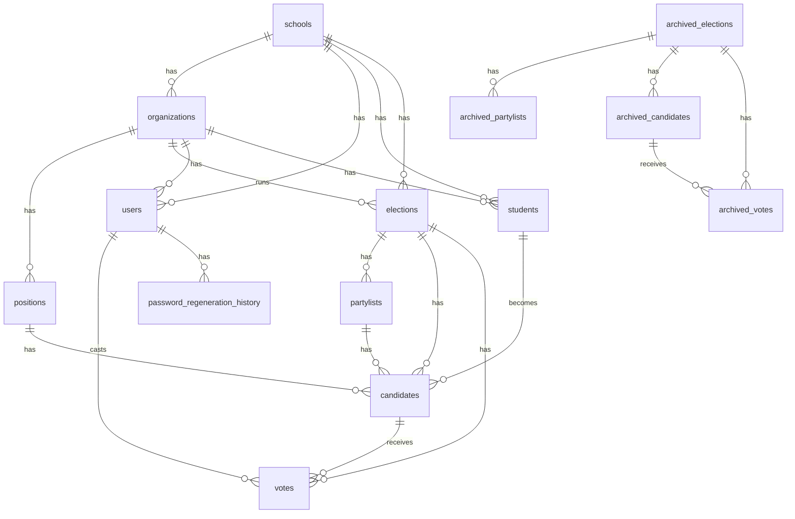
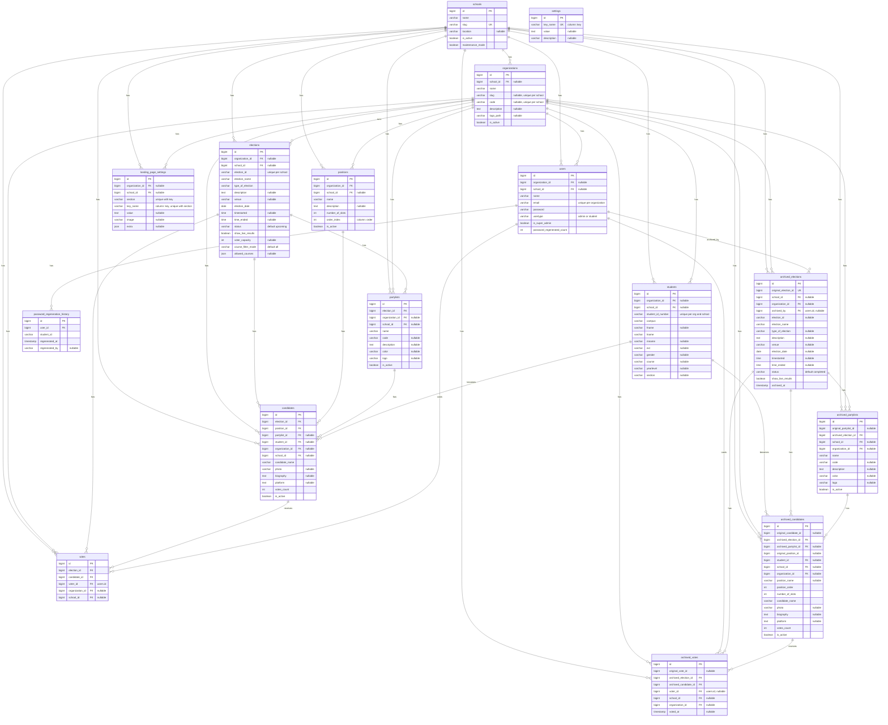

# Cloud-Based Real-Time Voting System (CBRTV-S) — Entity Relationship Diagram

This document describes the database schema as derived from the Laravel migrations in
`database/migrations/` and the Eloquent models in `app/Models/`.

> Note: All tables also include the standard Laravel `created_at` and `updated_at`
> timestamps. The `users` table additionally has `remember_token` and
> `email_verified_at` columns. These are omitted from the entity boxes below to keep
> the diagram readable.

---

## High-level relationships

---

## Detailed schema (all tables)

> Mermaid does not allow the reserved words `key` and `order` as column names, so the
> diagram renames `landing_page_settings.key` to `key_name`, `settings.key` to
> `key_name`, and `positions.order` to `order_index`. The actual database column
> names are `key` and `order` respectively (see `schema.dbml` for the exact column
> names).

---

## Composite unique constraints

| Table                    | Unique columns                                              |
|--------------------------|-------------------------------------------------------------|
| users                    | (`organization_id`, `email`)                                |
| students                 | (`organization_id`, `student_id_number`) and (`student_id_number`, `school_id`) |
| organizations            | (`slug`, `school_id`) and (`code`, `school_id`)             |
| elections                | (`election_id`, `school_id`)                                |
| votes                    | (`election_id`, `voter_id`, `candidate_id`)                 |
| landing_page_settings    | (`section`, `key`)                                          |

## Single-column unique constraints

| Table                    | Unique column            |
|--------------------------|--------------------------|
| schools                  | `slug`                   |
| settings                 | `key`                    |
| archived_elections       | `original_election_id`   |

---

## Notes

- The system is multi-tenant. Most tables carry both `school_id` (the tenant root)
  and `organization_id` (a sub-grouping such as `SSG`, `FLP`, `Classroom`).
- A `user` with `usertype = 'admin'` can also be `is_super_admin = true`, in which
  case `school_id` is typically `NULL` (global admin).
- A `vote` belongs to a `user` (the voter, via `voter_id`) — students vote through
  their `users` account, not directly via the `students` row.
- The `archived_*` tables freeze a snapshot of an election at the moment it is
  archived. They reference live `students` and `users` (so historical references
  survive) but use `nullOnDelete()` so deleting a live row does not break the
  archive.
- The standalone `settings` table is a global key/value store. The legacy global
  `maintenance_mode` setting was migrated into a per-school `schools.maintenance_mode`
  column.
